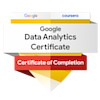

# Greetings!👋  

My name is Dongli Liu,  Welcome to my GitHub!🏡

🌱 I'm learning **software - AI** 🤖 in Centennial College.  

❤️ My favorite are **coding**💻 and **math**🔢.   

🏖️ I'm playing around **machine learning**🧠, **MERN**🕸️, **java**☕, **python**, and more  

## === Current Activities ===

👨‍💼 Looking for **CO-OP** opportunities.

🎓 Preparing for the 4th semester.

🩳 Building a [URL Shortening System](https://github.com/Dongli99/MERN-UrlShortenSys) individually to practice **web application**. ([Demo](https://u.dongli.ca)) 

🧠 Learning **Tensorflow**. 

## === Freshly Achieved ===

🔢 Coded what I learn in [**Linear Algebra**](https://github.com/Dongli99/MatrixCalc) course.

🫠Built a Student Management App using **MERN** as a **database programmer** in a group.

☕ Developed a Java application to communicate with Database using [JDBC](https://github.com/Dongli99/JDBC-Communicator) (V1). 

🧬 A [**NLP**(Natual Language Processing) model](https://github.com/Dongli99/NLP-SpamClassify) to filter spam of Youtube reviews is in progress. 

🏆 Got an overall GPA **4.38**.

 Obtained [Google Data Analytics certificate](https://www.coursera.org/professional-certificates/google-data-analytics) with a bunch of new skills.  

🚲 Learned **R** and completed [**sharing bike analytics notebook**](https://docs.google.com/presentation/d/1Hk36fAt6Zx2YISS7JFaht5jf18-jFTrqcbvt6S9DnS0/present?slide=id.g287bd23f883_0_125) on Kaggle.

🏘️ **Analyzed** [strata fanance](https://docs.google.com/presentation/d/1RZidPTdfEYnw-JegUfAAka78iGbZwcCarNc6Dbd8UzE/present?slide=id.p) for a  community.

🩳 **Designed** [URL Shortening System](https://github.com/Dongli99/SW-Design-USS).

📈 Coded [**Statistics**](https://github.com/Dongli99/AutoStat) knowledge (will do documentation and fix a table reading bug later).

## === Skills ===

### Software Developing

 

   

### Data Analytics + Machine Learning
  
            
       

### Full-stack Development

